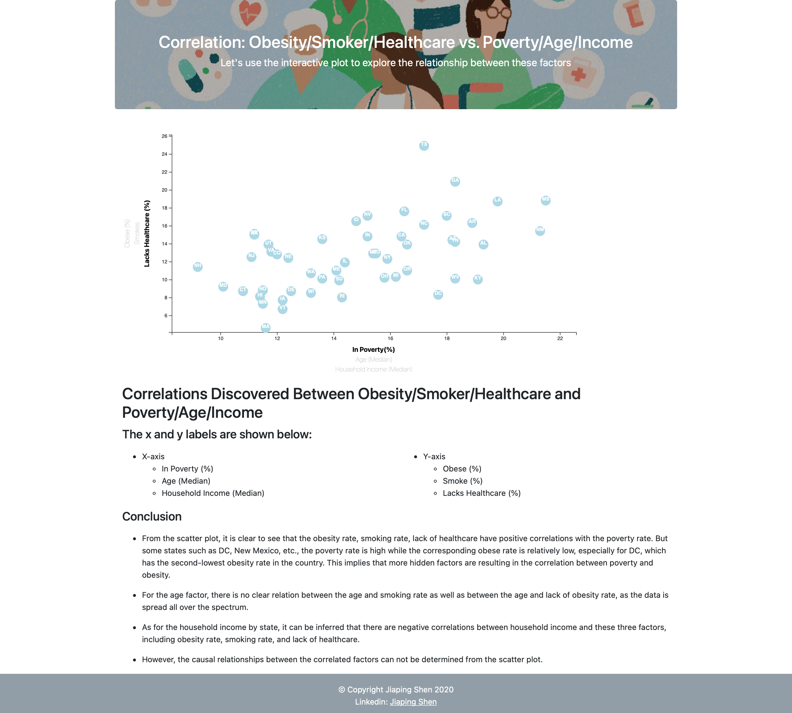

# Correlation: Obesity/Smoker/Healthcare vs. Poverty/Age/Income

---

## Project Description

The goal of the project is to create a responsive and interactive plot to explore the correlation between health risk factors and demographics. The `Javascript-D3` library was used to create multiple and interactive scatterplots in addition to `HTML`, `CSS`, `Bootstrap`, and `Javascript`.

- All the project files are contained in this repo.

### Sample Webpage Screenshot

## Instructions

### Steps

1. Run a python -m http.server or any other server for this purpose.
2. Load the `index.html` file.

## File Description

### - index.html

- Contains the HTML code that drives the plots and references the required libraries

### - assets

- Contains the `CSS` file with the formatting information and background image
- Contains the `data` file with the data used to plot
- Contains the `js` with the `Javascript` code using the D3 library for the interactive plots

### - images

- Contains the `gif` and `png` files with screenshots of the webpage running